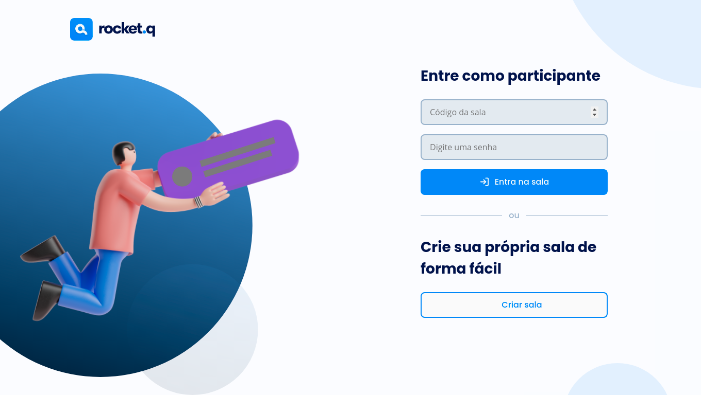
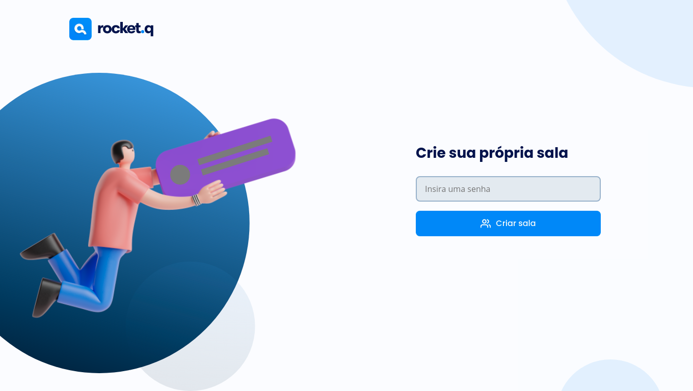
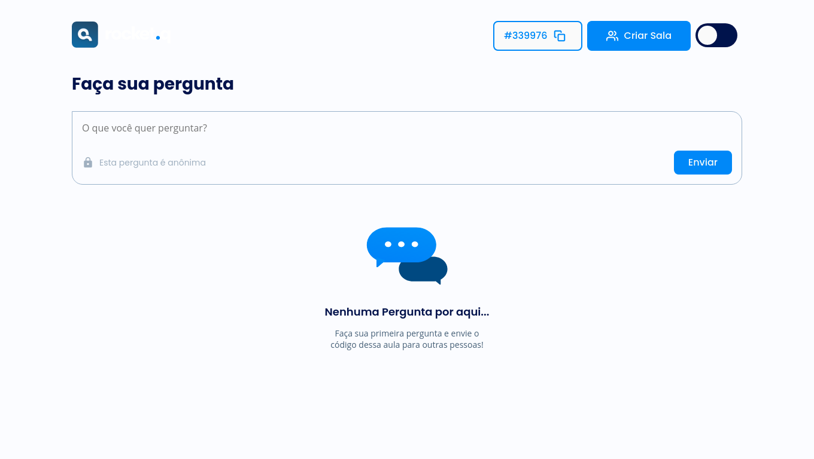
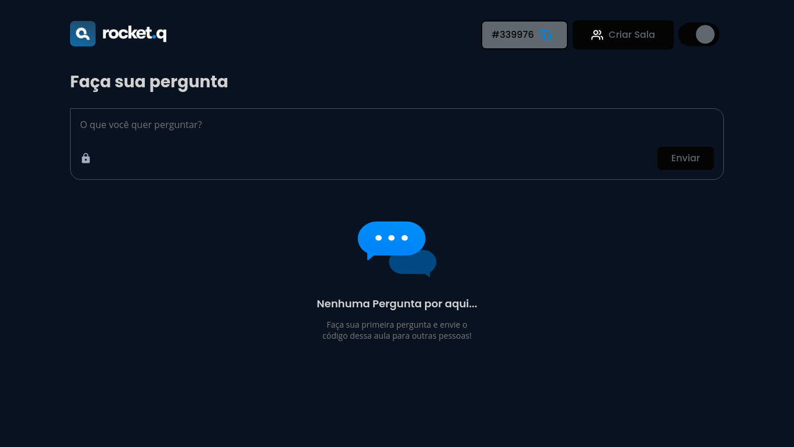
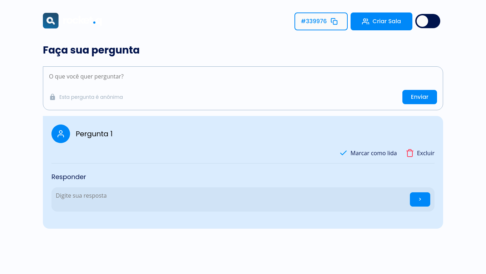
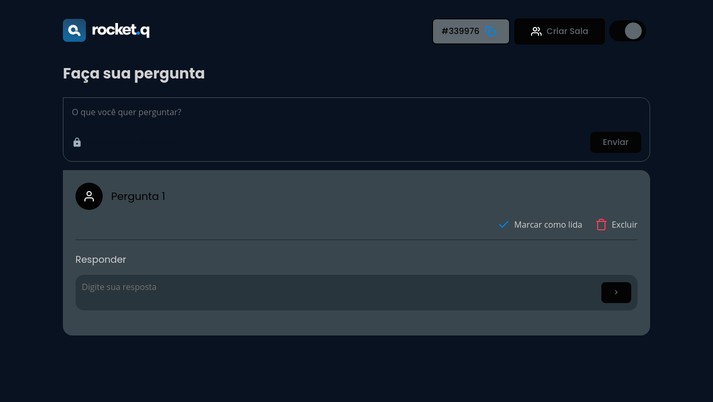
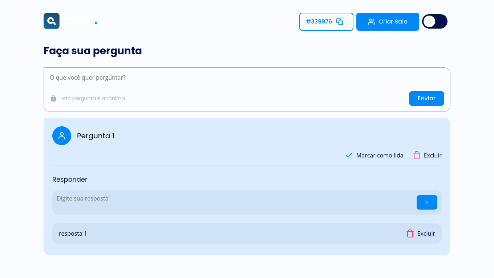
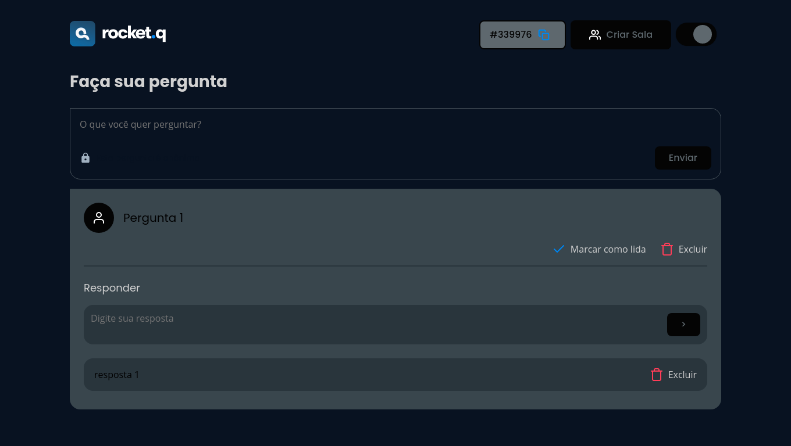
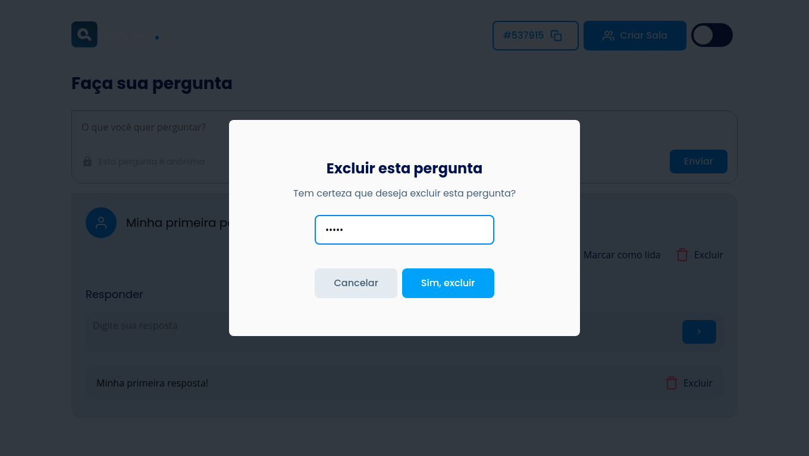
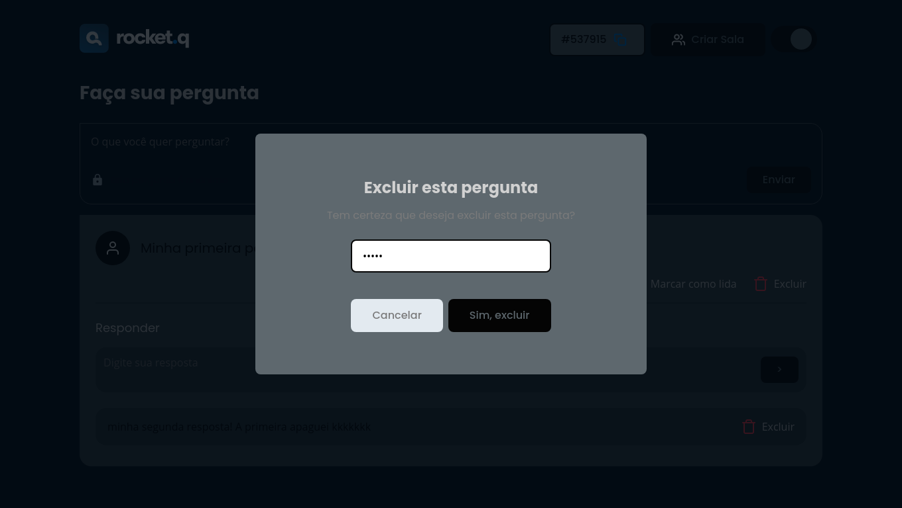

<h1 align="center">
    
</h1>

<h4 align="center"> 
	🚧 Projeto Rocket.q 🚀 em desenvolvimento... 🚧
</h4>


<p align="center">
  

  

  	
  <a href="https://twitter.com/MatheusSeganti4/">
    
  </a>
	
  
  <a href="https://github.com/msegantini9">
    
  </a>

  
   <a href="https://github.com/msegantini9/NLW-6/stargazers">
    
  </a>
</p>


<p align="center">
 <a href="#objetivo">Sobre o projeto</a> •
 <a href="#layout">Layout</a> • 
 <a href="#web">Web</a> • 
 <a href="#tecnologias">Tecnologias</a> • 
 <a href="#executar">Como executar o projeto</a> • 
 <a href="#pre-requisitos">Pré-requisitos</a>
 <a href="#rodando">Rodando a aplicação</a>
</p>

<h2 id="objetivo"📔 Sobre o projeto</h2>

📋 Roquet.q -  um website com o proprósito de permitir pessoas à enviar anônimamente perguntas ao criador da sala

As pessoas poderão usar o site de duas formas, criando uma sala ou entrando em uma já criada, apenas inserindo uma senha de seu gosto

Projeto desenvolvido durante a **NLW - TOGETHER** oferecida pela [Rocketseat](https://github.com/Rocketseat).
O NLW é uma experiência online com muito conteúdo prático, desafios e hacks onde o conteúdo fica disponível durante uma semana.


<h2 id="layout🎨 Layout</h2>

O layout da aplicação está disponível no Figma:

<a href="https://www.figma.com/file/VKWrverRFtveSseOp1CWz2/Roquet.q-%2302-(Copy)?node-id=0%3A1">
  
</a>

<h3 id="web">💻 Web</h3>

<p align="center" style="display: flex; align-items: flex-start; justify-content: center;">
  
  
  
  
  
  
  
  
  
  
</p>

<h2 id="tecnologias"⚙️ Tecnologias</h2>

As seguintes ferramentas foram usadas na construção do projeto:

- [HTML](https://developer.mozilla.org/pt-BR/docs/Web/HTML)
- [CSS](https://developer.mozilla.org/pt-BR/docs/Web/CSS)
- [JavaScript](https://developer.mozilla.org/pt-BR/docs/Web/JavaScript)
- [Node.js](https://expressjs.com/pt-br/)
- [EJS](https://ejs.co/)
- [Express](https://expressjs.com/pt-br/)
- [SQLite](https://www.sqlite.org/index.html)

<h2 id="executar">🚀 Como executar o projeto</h2>

Podemos executar o projeto seguindos as instruções abaixo e acessando http://localhost:3000/ para visualizar a página

<h3 id="pre-requisitos">Pré-requisitos</h3>

Antes de começar, você vai precisar ter instalado em sua máquina as seguintes ferramentas:
[Git](https://git-scm.com), [Node.js](https://nodejs.org/en/)
Além disto é bom ter um editor para trabalhar com o código como [VSCode](https://code.visualstudio.com/)


<h3 id="rodando">🧭 Rodando a aplicação</h3>

```bash
# Clone este repositório
$ git clone https://github.com/msegantini9/NLW-6

# Acesse a pasta do projeto no seu terminal/cmd
$ cd NLW-6

# Instale as dependências
$ npm install

# Execute a aplicação em modo de desenvolvimento
$ npm run start

# A aplicação será aberta na porta:3000 - acesse http://localhost:3000
```
